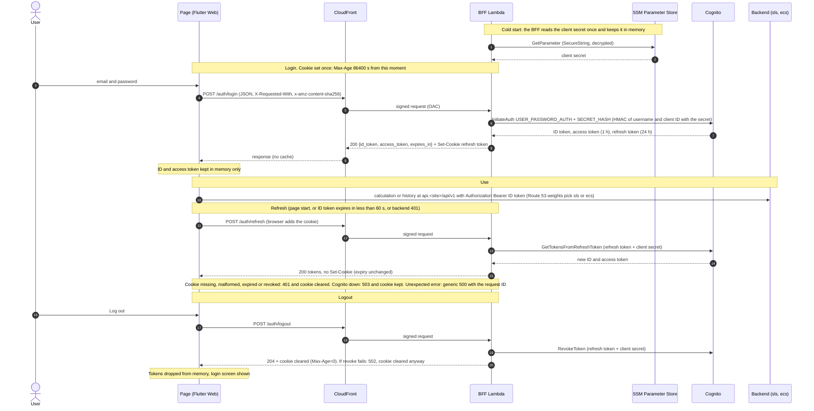

# Architecture

The calculator web page is a Flutter Web app served from S3 through CloudFront, in `dev` and `prod`. Each environment lives in its own AWS account, region `us-east-2` (the ACM certificate and the WAF scope are in `us-east-1`; CloudFront and Route 53 are global). The same compiled page is served in both.

Diagram: [`architecture.drawio`](architecture.drawio) (exported as `architecture.png`).

## What the BFF is and where it runs

The BFF (backend for frontend) is **an AWS Lambda function deployed by this repository** (`modules/auth-bff`, code in `src/auth_bff`). It runs **behind the page's CloudFront distribution**: CloudFront routes `/auth/*` to the function's function URL and everything else to the S3 bucket. It is **not code running inside CloudFront** (not a CloudFront Function and not Lambda@Edge).

Its only job is the session: login, refresh and logout against Amazon Cognito, keeping the long-lived refresh token in an `HttpOnly` cookie. It authenticates to Cognito as a confidential app client: the client secret lives in an SSM SecureString parameter and the BFF reads it once at cold start (see [ADR 0004](adr/0004-confidential-app-client.md)). It is not a proxy: the page calls the chosen backend (sls, ecs, ...) directly with a bearer token, so the page stays shared between backends. Which backend answers is decided in Route 53 by the weighted records of the shared API hostname, owned by this repository (see [Shared API hostname](#shared-api-hostname)).

## Components

| Component | Where | Role |
|---|---|---|
| Flutter Web page | S3 bucket (private, OAC) via CloudFront | UI, session controller, API client. Keeps the ID and access tokens in memory only. |
| CloudFront distribution | global, custom domain with ACM certificate | Single public entry point. Default behavior to S3; ordered behavior `/auth/*` to the BFF, no cache. Security headers and CSP. |
| Shared WAF web ACL | existing, created outside this repository, **prod only** | Associated by ARN (`WAF_WEB_ACL_ARN`); covers the whole distribution. |
| BFF Lambda | this repo, us-east-2, Python 3.14, arm64, outside any VPC | Login, refresh, logout. Function URL with `AWS_IAM` authorization, reachable only through CloudFront (origin access control of type `lambda`). Execution role writes its own logs and reads one SSM parameter (the client secret); X-Ray in prod. |
| Cognito user pool + confidential app client | this repo, us-east-2 | Local users created by the owner. Issues the tokens. The client has a secret, so only the BFF can sign in, renew or revoke. |
| SSM parameter (SecureString) | this repo, us-east-2 | Holds the app client secret (`/<context>/<env>/auth/app-client-secret`, standard tier, AWS managed key). Read by the BFF role only. |
| CloudWatch logs and alarms | us-east-2 | One JSON line per request; alarms on Errors and Throttles notify a dedicated SNS topic (us-east-2, email). |
| API certificate | this repo (`modules/api-hostname`), us-east-2 | Regional ACM certificate for `api.<web domain>`, DNS validated; ARN published in SSM `/oecalc/<env>/api-certificate-arn` for the backends. Expiry alarms with a us-east-2 SNS topic. |
| Weighted API records | this repo, Route 53 | One weighted `A` alias per backend that has published its target; weights from `API_WEIGHT_SLS` and `API_WEIGHT_ECS`. |
| Backends (sls, ecs, ...) | other repositories | Publish their target in SSM (`/oecalc/<env>/api-backends/<backend>/...`); answer the neutral path `/api/v1`. Validate the ID token with the pool of their environment (`COGNITO_USER_POOL_ID`, `COGNITO_APP_CLIENT_ID`). |

## Trust boundaries

1. **Browser <-> CloudFront**: the internet. TLS 1.2 or later, HSTS, CSP. In prod the shared WAF filters requests first.
2. **CloudFront <-> BFF function URL**: CloudFront signs each request (SigV4, origin access control). Lambda refuses unsigned calls. The resource policy allows only the `cloudfront.amazonaws.com` principal with the source ARN of this environment's distribution (permissions `lambda:InvokeFunctionUrl` and `lambda:InvokeFunction`).
3. **BFF <-> Cognito**: public Cognito endpoints over TLS. The BFF calls `InitiateAuth`, `GetTokensFromRefreshToken` and `RevokeToken` without AWS credentials (unsigned), but authenticated as the confidential app client: `SECRET_HASH` at login and the client secret on renewal and revocation. Its role therefore has no Cognito permission, and a call without the secret is refused by Cognito (not yet verified in a deployed environment, task 6.6). "Unsigned" here does not mean unauthenticated.
3a. **BFF <-> SSM Parameter Store**: a normal signed call with the function role, once per cold start, to read the client secret (`ssm:GetParameter` on that one parameter). The secret stays in the memory of the function.
4. **Browser <-> backends**: a direct call to `https://api.<site>/api/v1` with `Authorization: Bearer <ID token>`; the BFF is not involved. The address is calculated from the page origin (read-only label), so a user cannot point the token elsewhere. The page sends the token only to `https` addresses (or `http://localhost` and `127.0.0.1` for a local build-time override).
5. **Account boundary**: `dev` and `prod` are separate accounts with separate pools, functions and distributions.

Passwords pass through the memory of the BFF during login and are never stored or logged.

## Where each token lives and how long it lasts

| Token | Lifetime | Lives in | Notes |
|---|---|---|---|
| Refresh token | 24 hours **from the login**, never extended | Cookie `__Secure-oecalc-refresh` (`HttpOnly; Secure; SameSite=Strict; Path=/auth`, `Max-Age=86400`) and Cognito | Set only by login. JavaScript cannot read it. Refresh never reissues it. Rotation is off. |
| ID token | 1 hour | Memory of the page | Sent as the bearer to the backends. Renewed when it expires in less than 60 seconds. |
| Access token | 1 hour | Memory of the page | Returned by the BFF; not used by the page for calls. |

Nothing is written to `localStorage`, `sessionStorage`, other cookies or logs.

## Flows

## Environments

| | dev | prod |
|---|---|---|
| Domain | `over-engineered-simple-calculator.dev.nube-segura.com` | `over-engineered-simple-calculator.nube-segura.com` |
| AWS account | its own | its own |
| WAF web ACL | none | existing shared one (`WAF_WEB_ACL_ARN`) |
| Cognito deletion protection | off | on |
| BFF log retention | 30 days | 365 days |
| BFF X-Ray tracing | off | active |
| CloudFront price class | `PriceClass_100` | `PriceClass_All` |

All differences are in `environments/<env>/env.hcl`; the Terragrunt units are identical.

## Resource inventory

One row per resource (or group) created or changed by this repository. Name pattern: `<acronym>-<region>-<context>[-<descriptor>]-<env>` with `<region>` written without hyphens (`useast2`), `<context>` = `oecalc` and `<env>` = `dev` or `prod`. `<account-id>` is the AWS account of the environment. Status: **new** = added by spec 001-cognito-auth-bff or, where marked, by spec 002-ecs-backend-cutover; **changed** = existed before and was modified; **kept** = pre-existing and unchanged by the spec. Every resource carries the mandatory tags from `environments/root.hcl` (`team-owner`, `project-name`, `app-name`, `repo-name`, `env-type`).

| Resource | IaC type | Real name (pattern) | Purpose | Env / dev vs prod | Status / cost note |
|---|---|---|---|---|---|
| Cognito user pool | `aws_cognito_user_pool` | `cgnp-useast2-oecalc-<env>` | Local users, tier `LITE`, email as username | dev and prod; deletion protection `INACTIVE` in dev, `ACTIVE` in prod | new; free within the free tier |
| Cognito app client | `aws_cognito_user_pool_client` | `cgnc-useast2-oecalc-<env>` | Confidential client (secret) used only by the BFF | dev and prod, same | new (replaced when the secret was enabled, new client ID) |
| SSM parameter | `aws_ssm_parameter` | `/oecalc/<env>/auth/app-client-secret` | Client secret, `SecureString`, standard tier, AWS managed key | dev and prod, same | new; standard tier has no charge |
| BFF Lambda function | `aws_lambda_function` | `fnc-useast2-oecalc-auth-bff-<env>` | Login, refresh, logout; Python 3.14, arm64, 256 MB, 10 s | dev and prod; X-Ray `PassThrough` in dev, `Active` in prod | new; pay per request, no reserved concurrency (ADR 0002) |
| Function URL | `aws_lambda_function_url` | generated host `<id>.lambda-url.us-east-2.on.aws` | Origin of CloudFront for `/auth/*`, `AWS_IAM` | dev and prod, same | new; no charge |
| Lambda permissions | `aws_lambda_permission` x2 | statement IDs `AllowCloudFrontInvokeFunctionUrl`, `AllowCloudFrontInvokeFunction` | Allow only this environment's distribution to invoke the function URL | dev and prod, same (in `modules/frontend`) | new |
| BFF execution role | `aws_iam_role` | `role-useast2-oecalc-auth-bff-<env>` | Lambda assume role. **Keeps the old `role-` prefix** (not `iamr-`) | dev and prod, same | new |
| BFF role policy | `aws_iam_role_policy` | `iamp-useast2-oecalc-auth-bff-<env>` | Own logs, one SSM parameter, X-Ray only when tracing is active | dev and prod; X-Ray statement only in prod | new |
| BFF log group | `aws_cloudwatch_log_group` | `/aws/lambda/fnc-useast2-oecalc-auth-bff-<env>` | JSON request logs | retention 30 days in dev, 365 in prod | new; storage grows with retention |
| BFF SNS topic | `aws_sns_topic`, `aws_sns_topic_policy`, `aws_sns_topic_subscription` (email) | `sns-useast2-oecalc-auth-bff-alerts-<env>` (**us-east-2**) | Notifies the two alarms below; policy allows `cloudwatch.amazonaws.com` of this account and denies insecure transport | dev and prod, same | new; AWS managed encryption only (gap G8) |
| BFF alarms | `aws_cloudwatch_metric_alarm` x2 | `alrm-useast2-oecalc-auth-bff-errors-<env>`, `alrm-useast2-oecalc-auth-bff-throttles-<env>` | `Errors` and `Throttles` >= 1 in 5 minutes | dev and prod, same | new; standard alarm price each |
| Origin access control (BFF) | `aws_cloudfront_origin_access_control` (type `lambda`) | `oac-useast2-oecalc-auth-bff-<env>` | SigV4 signing of requests to the function URL | dev and prod, same | new; no charge |
| Origin access control (web) | `aws_cloudfront_origin_access_control` (type `s3`) | `oac-useast2-oecalc-web-<env>` | SigV4 signing of requests to the bucket | dev and prod, same | kept |
| Response headers policy | `aws_cloudfront_response_headers_policy` | `rhp-useast2-oecalc-web-<env>` | HSTS, nosniff, frame deny, referrer policy, CSP | dev and prod, same | changed (CSP added, applied to both behaviors) |
| CloudFront distribution | `aws_cloudfront_distribution` | Name tag `cdn-useast2-oecalc-web-<env>`; aliases `over-engineered-simple-calculator.dev.nube-segura.com` (dev), `over-engineered-simple-calculator.nube-segura.com` (prod) | Single entry point; origins `s3-web` and `lambda-auth-bff`; behavior `/auth/*` added | dev: `PriceClass_100`, no WAF; prod: `PriceClass_All`, shared WAF by ARN, plan fails if the ARN is empty | changed (second origin, ordered behavior, response headers policy). Requests to `/auth/*` are billed as uncached requests |
| Shared WAF web ACL | referenced by `web_acl_id` (not created here) | existing, passed as `WAF_WEB_ACL_ARN` | Filters the whole distribution | **prod only** | kept; owned outside this repository |
| S3 bucket and settings | `aws_s3_bucket` plus ownership controls, public access block, versioning, SSE (AES256), lifecycle, bucket policy | `bckt-useast2-oecalc-web-<env>-<account-id>` | Private bucket with the compiled page; read only by this distribution; TLS required | `force_destroy` true in dev, false in prod; noncurrent versions expire after 30 days | kept |
| ACM certificate and validation | `aws_acm_certificate`, `aws_acm_certificate_validation` (us-east-1) | Name tag `acm-useast2-oecalc-web-<env>` | TLS for the custom domain, DNS validated, RSA 2048 | dev and prod, domain differs | kept |
| Route 53 records | `aws_route53_record` (validation CNAME, `A` and `AAAA` alias) | the environment's domain name, in the hosted zone `<route53-zone-id>` of the account | DNS to CloudFront | dev and prod, domain differs | kept |
| Web alert topic and certificate alarms | `aws_sns_topic`, policy, email subscription, `aws_cloudwatch_metric_alarm` x4 (us-east-1) | `sns-useast1-oecalc-web-alerts-<env>`, `alrm-useast1-oecalc-web-cert-expiry-<N>d-<env>` with N = 90, 60, 30, 15 (four alarms) | Certificate expiry (ACM metric exists only in us-east-1) | dev and prod, same | kept |
| API certificate | `aws_acm_certificate` (us-east-2) | Name tag `acm-useast2-oecalc-api-<env>`; domain `api.<web domain>` | Regional TLS certificate of the shared API hostname, RSA 2048, DNS validated, `create_before_destroy` | dev and prod, domain differs | new (002); free |
| API certificate validation | `aws_route53_record` (CNAME, `allow_overwrite`), `aws_acm_certificate_validation` | validation name generated by ACM, in the environment's hosted zone | Validates the API certificate; the record may already exist (written before by the sls repository) and must not be deleted while another certificate uses it | dev and prod, same | new (002) |
| API certificate ARN parameter | `aws_ssm_parameter` (`String`, standard) | `/oecalc/<env>/api-certificate-arn`; Name tag `ssm-useast2-oecalc-api-certificate-arn-<env>` | Contract: backends read the ARN to attach the certificate to their custom domain | dev and prod, same | new (002); no charge |
| Weighted API records | `aws_route53_record` (`A` alias, weighted, `for_each` over published backends) | `api.<web domain>`, set identifier `sls` or `ecs` | Route traffic by weight; target read from `/oecalc/<env>/api-backends/<backend>/{dns-name,hosted-zone-id}`; a backend that has not published is skipped | weights from `API_WEIGHT_SLS` and `API_WEIGHT_ECS`; dev currently sls 0, ecs 100 | new (002); alias queries to AWS targets are not charged, hosted zone unchanged |
| Weights guard | `terraform_data` with a precondition | `weights_guard` (no cloud resource) | Fails the plan when every published backend has weight 0 | dev and prod, same | new (002) |
| API alert topic | `aws_sns_topic`, policy, email subscription (us-east-2) | `sns-useast2-oecalc-api-alerts-<env>` | Notifies the certificate expiry alarms; policy allows `cloudwatch.amazonaws.com` of this account and denies insecure transport | dev and prod, same | new (002); AWS managed encryption only (same as G8) |
| API certificate expiry alarms | `aws_cloudwatch_metric_alarm` x4 | `alrm-useast2-oecalc-api-cert-expiry-<N>d-<env>`, N = 90, 60, 30, 15 | `DaysToExpiry` below N days (certificate moved here from sls with its monitoring) | dev and prod, same | new (002); standard alarm price each |
| Terraform state | S3 bucket `bckt-useast2-tf-state-<env>-<account-id>` (outside this repository) | one state file per unit, key `over-engineered-simple-calculator-webpage/<env>/<unit path>/terraform.tfstate` (`edge/auth`, `edge/auth-bff`, `edge/frontend`, `api-hostname`) | Remote state with native locking; also holds the client secret in clear text (gap G10) | dev and prod | kept |

Removed: no Terraform resource was removed by specs 001 or 002. In the page, the API key field and header were replaced by the Cognito login (001) and the editable Service URL field by a read-only label (002).

### Known gaps in the inventory

- **CFD-13 (geo restriction):** the distribution has `restriction_type = "none"`. Accepted by the owner for now; it existed before this spec. Team default: a block list (CN, RU, KP, BY, IR, SY) in both environments.
- **CFD-05 (CloudFront logging):** the distribution has no standard or real-time logs. Accepted for now; it existed before this spec. Team rule: logging is required in prod.
- The BFF execution role keeps the old `role-` prefix (`role-useast2-oecalc-auth-bff-<env>`) and was not renamed to the current IAM role acronym.
- Accepted gaps from the design review: G1 (local users, no federation, [ADR 0003](adr/0003-cognito-local-users-federation-gap-accepted.md)), G3 (log group without a customer managed key), G8 (SNS topic without a customer managed key), G9 (no permissions boundary), G10 (client secret in the state).

## Deployment units

`environments/<env>/edge/auth` (Cognito) -> `edge/auth-bff` (Lambda, alarms; needs the app client ID) -> `edge/frontend` (S3, CloudFront, certificate, DNS; needs the function name and URL host). Terragrunt orders them by dependency. `environments/<env>/api-hostname` (API certificate, weighted records, alarms) depends on none of them. The Lambda permission for CloudFront lives in `modules/frontend` because it needs the distribution ARN.

## Shared API hostname

`api.<web domain>` (for example `api.over-engineered-simple-calculator.dev.nube-segura.com` in dev) is owned by this repository ([ADR 0006](adr/0006-weights-owned-by-the-webpage-repository.md)). It resolves through weighted alias records, one per backend (`sls`, `ecs`, later others), to the load balancer or API Gateway domain that the backend publishes in SSM. All backends answer `/api/v1` ([ADR 0007](adr/0007-neutral-api-path.md)) and use the shared regional certificate whose ARN is in `/oecalc/<env>/api-certificate-arn`. Changing the GitHub variables `API_WEIGHT_SLS` and `API_WEIGHT_ECS` and redeploying this repository moves traffic; neither the page nor the backends change. dev currently sends all traffic to ecs (sls 0, ecs 100).

The module refuses to plan when every published backend has weight 0. **Known limitation:** a backend's record appears only when this repository is deployed after the backend has published its SSM target (two-phase first deployment). A recorded, undecided option removes it with stable predictable targets and a separate path-filtered workflow for DNS and weights.

## Error handling in the BFF

Expected failures map to 400, 401, 409, 429, 502 and 503. Any unexpected exception in the handler path becomes one logged record and a generic 500 with the request ID and no detail. The BFF never answers 403 or 404 (CloudFront turns both into the app page).

## Not yet verified

These items are built but have not been checked against a deployed environment:

- the Content Security Policy in a browser;
- the `LITE` user pool tier;
- the real behavior of the function URL with origin access control;
- the `boto3` version of the Lambda runtime (it must include `get_tokens_from_refresh_token`; otherwise boto3 must be packaged);
- whether the Cognito console can mark a new user's password as permanent;
- that Cognito refuses a direct `InitiateAuth` for the client without the secret hash (task 6.6).
- the shared API hostname in a deployed environment (certificate issued, weighted records, handover of the existing sls record); verification of `dev` is tracked in the spec, not confirmed here.
